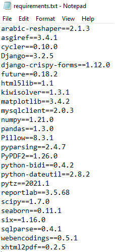

<h1 align="center">
  Cubezone
</h1>

  ** Demonstration **

  https://davidguevara.myportfolio.com/cubezone-reporte-de-ventas-django

  ** Requirements **

  Django 3.2.5  
  https://www.djangoproject.com/
   
  Virtualenv  
  https://virtualenv.pypa.io/en/latest/  
   
  

  ** Getting Started **

  1: Clone the repository
  
  2: Activate the Virtual environment

  3: Install the requirements

  4: Import the tables of database -> LocalHost_Files/cubezone.sql
  
  5: Execute "python manage.py runserver"

  6: Login with the user credentials -> LocalHost_Files/UserCredentials.txt

  7: Test the app

